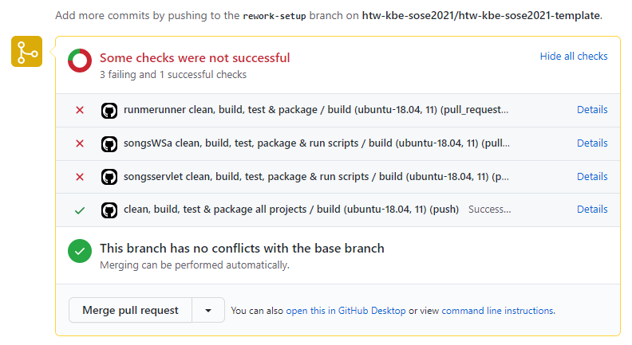

# KBE Projekt Template

| Name          | Matrikelnummer  |
| :------------ | --------------- |
| Davis  | MATRIKELNUMMER1 |
| Sakhr Al-absi | 562218 |


## KBE Repository einrichten

1. Lokal Repository klonen:
    ```bash
    git clone LINK_ZUM_TEMPLATE_REPOSITORY
    ```
1. Ersetzen Sie die Überschrift in `README.md `mit `TEAMNAME`
1. Geben Sie Ihre Teammitglieder in die Tabelle der `README.md` ein
1. Ändern sie den Namen des Repositories zu ihrem Teamnamen
1. Folge den Anweisungen in der `pom.xml`. Achten sie auch auf die `pom.xml` in den Unterordnern wie z.B. `runmerunner/pom.xml`
1. Führe die Befehle in [Befehle die immer funktionieren müssen](#befehle-die-immer-funktionieren-müssen) aus. Diese Befehle sollten nach ihren Änderungen funktionieren.
1. Erstelle ein privates Repository mit `TEAMNAME`
1. Fügen sie ihre lokalen Änderungen in das Repository hinzu:
    ```bash
    cd PFAD_ZUM_REPOSITORY
    git remote remove origin
    git remote add origin LINK_ZUM_EIGENEN_REPOSITORY
    git push origin main
    ```
1. Lesen sie sich die genau `README.md` durch.

## Konventionen für Branch Namen
Für die Belege gilt folgender Branch Namen:
- runmerunner: `runmerunner`
- songsservlet: `songsservlet`
- songsWSa: `songsWSa`
- songsWSb: `songsWSb`

## Belegpräsentation, Pull Request und Github Actions

Die Befehle im Abschnitt [Befehle die immer funktionieren müssen](#befehle-die-immer-funktionieren-müssen) sollten immer lokal funktionieren. Sie können eine IDE Ihrer Wahl zum Entwickeln verwenden. Allerdings müssen sie bei der Belegpräsentation unbedingt das Terminal verwenden und die Befehle nutzen. Andernfalls wird der Beleg nicht ausgewertet. Zusätzlich muss der auszuwertende Commit mit einem grünen Häkchen versehen sein siehe:


Bei einem Pull Request muss vor der Belegpräsentation nur der Workflow **clean, build, test & package all projects** funktionieren. Es ist normal, dass zunächst die anderen Workflows fehlschlagen, da die Testdatein fehlen siehe:



Jeder Pull-Request sollte keinen Merge-Konflikt besitzen. Dieser muss vor der Abgabe gelöst werden. Nach einer Erfolgreichen Belegpräsentation müssen sie sich die Testdateien von diesem Repository hinzufügen. Dazu folgen sie die Befehle im Abschnitt  [KBE Repository Updates erhalten](#kbe-repository-updates-erhalten). 

## KBE Repository Updates erhalten
In diesem Repository werden die Belegaufgaben und die Testdateien hochgeladen. Damit sie die Daten erhalten, müssen sie folgende Befehle ausführen:

### Setup (einmalig)

```
# zum Repository gehen
cd PFAD_ZUM_REPOSITORY

# den kbe Remote setzen (muss man nur einmal machen)
git remote add kbe git@github.com:htw-kbe-sose2021/sakvis.git
```

### Für Belegaufgaben
```
# zum Repository gehen
cd PFAD_ZUM_REPOSITORY

# In den Main Branch wechseln und updates erhalten
git checkout main

# Updates holen
git pull kbe main

# Updates in das eigene Repository hinzufügen
git push origin main
```


### Für Testdateien
```
# zum Repository gehen
cd PFAD_ZUM_REPOSITORY

# In den Main Branch wechseln und updates erhalten
git checkout BELEG_BRANCH

# Updates holen
git pull kbe main

# Updates in das eigene Repository hinzufügen
git push origin BELEG_BRANCH
```

## Befehle die immer funktionieren müssen

### runmerunner clean, bauen, testen & verpacken

```
mvn -pl runmerunner clean package 
```

ODER

```
cd runmerunner
mvn clean package 
```


### songsservlet clean, bauen, testen & verpacken

```
mvn -pl songsservlet clean package 
```

ODER

```
cd songsservlet
mvn clean package 
```


###  songsWS clean, bauen, testen & verpacken
```
mvn -pl songsWS clean package 
```

ODER

```
cd songsWS 
mvn clean package
```


### Alle Projekte clean, bauen, testen & verpacken
```
mvn clean package
```


